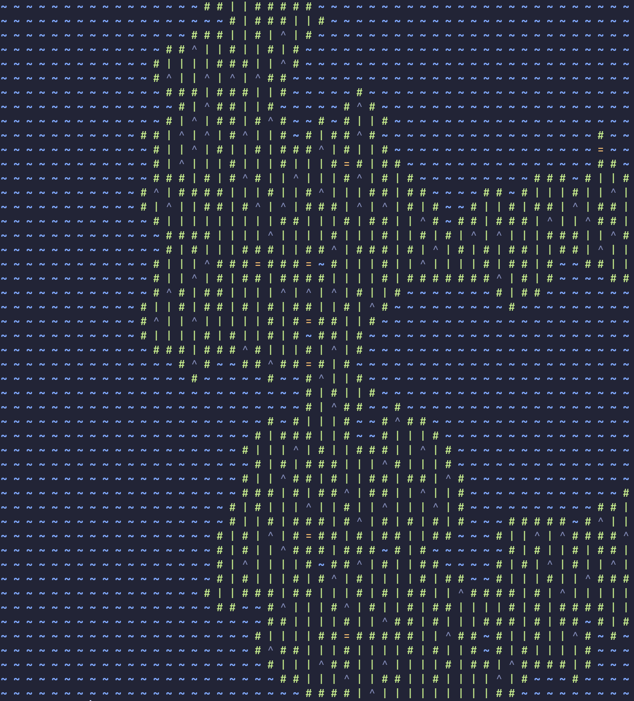

# wfc-c
An implementation of the wave function collapse algorithm with a static rule set.
### Usage
```
./wfc-c SIZE ANIMATE
```
where SIZE is an integer describing the size of each of the sides of the output (unfortunately this output is limited to being square), and ANIMATE is either 0 or 1 describing whether or not to animate the output.

### Example Output


### Tips and tricks
- If the animation is disabled and the output size is relatively small, the algorithm is fast enough to be piped directly into another program and can be used as, for example, the neofetch logo field.
- The algorithm will create a random output, however the seed only changes every second, so for the best results wait a second before calling the algorithm again (if not animating).
